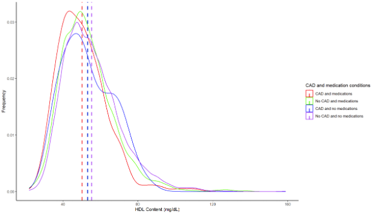
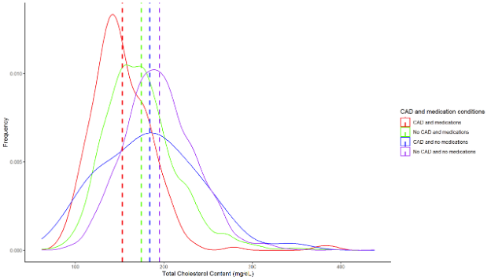
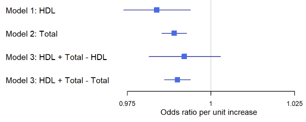

# Research Report

### Research Rationale
Caused by fat buildups in blood vessels, CAD is naturally assumed to be closely correlated with the blood cholesterol level. Specifically, one cholesterol named low-density lipoprotein (LDL) is often considered “bad” and the main cause of CAD due to its large volume. In contrast, another cholesterol named high-density lipoprotein (HDL) is usually assumed “good” as it takes up less space in blood vessels. However, is this assumption the truth?

### Research Question
Do HDL and other cholesterols influence the risk of coronary artery disease?

### Hypothesis
A lower HDL level in blood vessels is associated with a higher risk of developing CAD.

### Data Source
National Health and Nutrition Examination Survey (NHANES): https://www.cdc.gov/nchs/nhanes/index.html
I analyzed 9 datasets spanning 2021 to 2023, specifically: "Cholesterol - High-Density Lipoprotein," "Medical Conditions," and "Demographics Data." The original data were obtained from a longitudinal survey of over 10,000 participants.

### Data Cleaning
The datasets were then merged into a new dataset based on the shared column “Respondent Sequence Number (SEQN).” In the new dataset, each row corresponded to a participant, and the columns included “SEQN,” “gender (RIAGENDR),” “age in years at screening (RIDAGEYR),” “direct HDL-cholesterol in mg/dL (LBDHDD),” “total cholesterol in mg/dL (LBXTC),” “ever told you had coronary heart disease (MCQ160C),” and “taking meds to lower blood cholesterol? (BPQ101D).” 

### Methods
3 mutiple logistic regression tests: 
1) MCQ160C ~ RIAGENDR + RIDAGEYR + LBDHDD + BPQ101D (HDL on CAD)
2) MCQ160C ~ RIAGENDR + RIDAGEYR + LBXTC + BPQ101D (all types of cholesterol on CAD)
3) MCQ160C ~ RIAGENDR + RIDAGEYR + LBDHDD + LBXTC + BPQ101D (CAD & all types of cholesterol on CAD)

Note: The purpose of 3) is to adjust for the correlation between HDL and total cholesterol.

### Results
The rate of CAD was 5% in the surveyed population with an average age of 38 and a roughly 1:1 gender ratio (Table 1). The distribution plots (Figure 1 and Figure 2) showed that lower HDL levels and lower total cholesterol levels both implied a higher risk of developing CAD, but taking medications was effective in reducing the risk. It was also found that a 1 mg/dL increase in HDL was associated with an odds ratio of 0.984 (95% confidence interval: 0.973 – 0.994; p-value = 0.0017). However, when adjusted for the total cholesterol level, the same increase in HDL was associated with an odds ratio of 0.992 (95% confidence interval: 0.981 – 1.003; p-value = 0.147) (Figure 3).

### Table 1. Study Population Characteristics
|                           |  Mean  | Standard Deviation | Median |   IQR   | Missing Data |
| :-----------------------: | :----: | :----------------: | :----: | :-----: | :----------: |
|         Age (yrs)         | 38.32  |       25.60        |   37   |  13-62  |      0       |
|    Percentage of Women    |  0.53  |        N/A         |  N/A   |   N/A   |      0       |
|        HDL (mg/dL)        | 54.11  |       14.10        |   52   |  44-61  |     5043     |
| Total cholesterol (mg/dL) | 181.54 |       42.32        |  178   | 151-207 |     5043     |
|     Percentage of CAD     |  0.05  |        N/A         |  N/A   |   N/A   |     4160     |
|  Percentage of drug use   |  0.25  |        N/A         |  N/A   |   N/A   |     3468     |

### Figure 1. Distribution of HDL levels in populations with and without CAD

### Figure 2. Distribution of total cholesterol levels in populations with and without CAD

### Figure 3. Forest plots: effect sizes of HDL levels and total cholesterol levels on CAD

### Discussion
An odds ratio less than 1 indicated a protective effect of HDL on CAD. The greater odds ratio in the adjusted model suggested an attenuated protective effect, indicating that the total cholesterol level might act as a confounder in the correlation between HDL and CAD, which likely resulted from the interplay between HDL and other cholesterols, including LDL. Based on the results, the hypothesis that a higher content of HDL in blood vessels implies a lower risk of CAD could not be rejected. In other words, the common assumption was supported.

However, tons of previous studies denied the common assumption and provided various alternative hypotheses. For instance, Helgadottir et al. (2020) claimed that mutations in genes that code the proteins for the transportation of cholesterols can affect the absorption of cholesterols and thus influence the risk of CAD. Besides, Cho et al. (2023) wrote that a lot of factors other than the cholesterol content such as lifestyles, genetics, and sociodemographic characteristics could be candidate causes of CAD. 

The limitation of this study might explain the difference between its results and those of other studies. The NHANES data did not exclude individuals with CAD who were taking medicine or receiving treatment at the time of screening, which could disrupt the correlation between HDL levels and the risk of CAD via lowered HDL levels due to medical intervention. This could in turn result in reverse causation as it was not possible to quantitatively analyze how much of the change in disease risk was due to drug use versus an actual change in biomarkers. Likewise, the confounding effect of total cholesterol levels on the correlation between HDL and CAD could not be quantified either, hindering further understanding of the interplay between HDL and LDL. Future studies can set up instrumental variables and add them to the association between baseline lipid level and disease incidents to better capture the bias of data selection and measure the confounding effect. 

In conclusion, this research demonstrated that HDL has a protective effect on CAD, but the strength of this effect might be influenced by other cholesterol levels. Therefore, the care of CAD can focus on increasing the proportion of HDL in all cholesterols through supplements and surgery.
